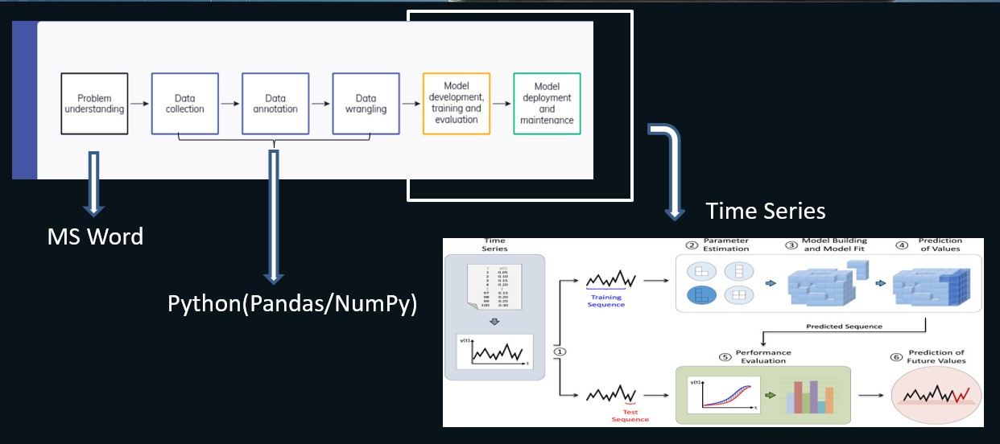

# ML-Sales_Forecasting
End-to-End Machine Learning Project with Sales Data

## Domain Background

### What is the Meaning of Retail?

Retail is how producers of goods and services get their products to the consumer. Retailers often get their goods directly from the manufacturer.That is when a commodity becomes a finished product.

Retailers can also buy products from a store person, wholesaler, or distributor

### How Retail Works?

Retailers make money by purchasing goods from suppliers and manufacturers. They raise prices well above the cost of labor, equipment, and distribution. Everyone along the supply chain does this.

Retailers can sometimes make more money if they bypass wholesalers and purchase directly from the factory.

This price increase is known as a "markup" or the retailer's "profit margin." It's typically 100% (double the cost) at each stage. That's called "keystone markup." 

It's needed to cover costs and provide enough profit to pay stockholders or private owners.

### How we can help retail businesses through Machine learning models?

Retail is a subset of business where its sale occurs when a business sells a product or service to an individual consumer for his or her use. 

This retail industry is generating a large amount of customer data. 

Data science helps to gain insights from this data about the customers and market merging trends.

Some Data science use cases were used by retail industries to grow their industries in today’s world.
        
        Price optimization
        Personalized Marketing
        Fraud detection in Retail
        Utilizing social media
        Implementing Augmented Reality
        Merchandising
        Location of New Store
        Inventory Management
        Customer Sentiment Analysis
        Recommendation System

## Problem Statement

Goal: Provide recommended actions based on the insights drawn, with prioritization placed on the largest business impact

    Predict the weekly sales for the following year
    Analysis of the effects of markdowns on holiday weeks

## Data

I used a retail sales Dataset aset that can be found in  kaggle : https://www.kaggle.com/datasets/manjeetsingh/retaildataset

Dataset has total 3 csv files. 

To get more understanding of database please read the "Dataset Details" available on  Kaggle. 

## Installation

This project requires Python and the following Python libraries installed:

    NumPy
    Pandas
    matplotlib
    scikit-learn
    Fb Prophet

You will also need to have software installed to run and execute a Jupyter Notebook.

If you do not have Python installed yet, it is highly recommended that you install the Anaconda distribution of Python.

## Sales Prediction Project Life Cycle

## Contact

Pooja Sureja - www.linkedin.com/in/poojasureja11 - surejapoojads@gmail.com

Project Link: https://github.com/PoojaDS22/ML-Sales_Forecasting.git
